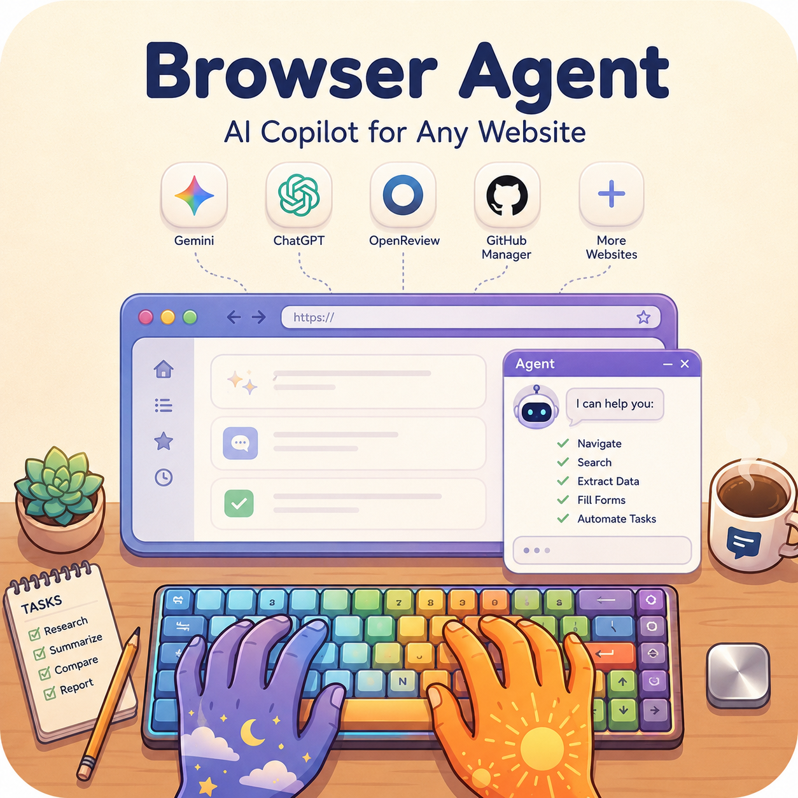

# Browser Agent

<p align="center">
  
</p>

<p align="center">
  <strong>CDP-native browser automation runtime for agents, with editable skills and reliable Gemini image workflows.</strong>
</p>

<p align="center">
  • Real Chrome Control • Skill-Driven Automation • Upload-Verified Image Generation •
</p>

<p align="center">
  <a href="#-features">Features</a> •
  <a href="#-quick-start">Quick Start</a> •
  <a href="#-workflows">Workflows</a> •
  <a href="#-safety-model">Safety Model</a> •
  <a href="SKILL.md">Agent Guide</a>
</p>

<p align="center">
  <a href="LICENSE"></a>
  
  
  
  
</p>

## Quick Navigation

> [!TIP]
> **I'm a human** -> Read this README for install, setup, and safe workflows.
>
> **I'm an agent** -> Read [SKILL.md](SKILL.md) for operation rules and execution patterns. (Recommended)

`browser-agent` is a minimal runtime that lets agents control your real Chrome session directly over CDP, while keeping task logic editable in-repo.

- **For operators**: one command surface for browser actions, diagnostics, and updates.
- **For agents**: stable helper APIs (`new_tab`, `js`, `click_at_xy`, `upload_file`, raw `cdp`).
- **For reliability**: interaction skills and domain skills to encode repeatable mechanics.

## Quick Start

Tell your coding agent:

> Install Browser Agent from `https://github.com/PaulClawX/browser-agent` and set it up to control my Chrome via CDP.

### 1) Install

```bash
git clone https://github.com/PaulClawX/browser-agent
cd browser-agent
uv tool install -e .
```

### 2) Verify

```bash
command -v browser-agent
browser-agent --version
browser-agent --doctor
```

### 3) First command

```bash
browser-agent -c 'print(page_info())'
```

## Browser Connection

### Attach to your normal Chrome profile

1. Open `chrome://inspect/#remote-debugging`
2. Enable `Allow remote debugging for this browser instance`
3. Accept the Chrome allow popup when prompted
4. Re-run:

```bash
browser-agent -c 'print(page_info())'
```

For full setup and troubleshooting, see [install.md](install.md).

## Features

- Direct CDP control against real Chrome tabs.
- Minimal daemon + IPC architecture.
- Rich helper APIs for navigation, DOM eval, input, uploads, screenshots, tabs.
- Interaction skills for repeatable UI mechanics.
- Domain skills for site-specific workflows.
- Gemini image generation/editing workflow with upload verification gate.

## Workflows

| Tier | Workflow | Expected Behavior |
|---|---|---|
| Stable | General browser automation | Deterministic tab + DOM + input operations through CDP helpers |
| Stable | Upload-driven tasks | Upload confirmation before submit; fail-fast if upload isn't verifiable |
| Stable | Gemini image generation/editing | Prompt + reference flow with strict upload-first gating and export |
| Stable | Diagnostics and lifecycle | `--doctor`, daemon auto-start, update checks |
| Best-effort | Complex anti-bot sites | Fallback to coordinate actions, retries, and skill-specific patterns |


## Core Command Pattern

```bash
browser-agent -c '
new_tab("https://example.com")
wait_for_load()
print(page_info())
'
```

Common helpers:

- `new_tab(url)`, `goto_url(url)`
- `page_info()`, `wait_for_load()`, `wait_for_element()`
- `click_at_xy(x, y)`, `type_text(text)`, `press_key(key)`
- `js(expression)`, `cdp(method, **params)`
- `upload_file(selector, path)`
- `capture_screenshot(path=None)`

## Project Layout

- `src/browser_harness/` - core runtime modules
- `SKILL.md` - operator rules for day-to-day use
- `install.md` - first-time install and connection
- `docs/interaction-skills/` - reusable browser mechanics playbooks
- `src/agent-workspace/agent_helpers.py` - task-specific helper extensions
- `docs/domain-skills/` - site-specific playbooks

## Interaction Skills

See [docs/interaction-skills/](docs/interaction-skills/) for practical playbooks, including:

- connection, dialogs, dropdowns, uploads
- tabs, iframes, cross-origin iframes, shadow DOM
- screenshots, scrolling, viewport
- Gemini image generation + editing


## Core Contributors and Maintainers

<table>
  <tr>
    <td align="center">
      <a href="https://github.com/paulpanwang">
        
      </a>
      <br />
      <sub><b>Panwang Pan</b></sub>
      <br />
      <sub><a href="mailto:paulpanwang@gmail.com">paulpanwang@gmail.com</a></sub>
    </td>
  </tr>
</table>


## 📧 Contact

Feel free to open an issue if you have any questions or suggestions.

If this project helps you, please give it a ⭐ Star!

## Acknowledgements

This project builds on and is inspired by the following open-source work:

- [browser-use/browser-harness](https://github.com/browser-use/browser-harness) - the primary code and architecture source.
- [OpenClaudex/openreview-agent](https://github.com/OpenClaudex/openreview-agent) - OpenReview dry-run workflow inspiration.
